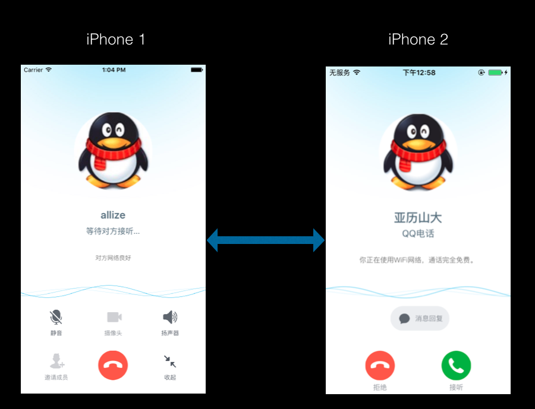

=====
多终端特性
=====

多终端特性是指在同一个测试用例中允许申请多台iOS设备进行测试和操作，实现多台iOS设备之间的协作测试。

----
应用场景
----
多终端特性适用于多台设备之间协作完成的测试场景，例如：iPhoneQQ音频通话、视频通话；来电的实时通话等。

----
使用方法
----
在测试用例创建一个新的Device对象，即申请一台终端设备，创建多个Device对象，即申请了多台终端设备。默认情况下，
申请的第一台设备为本地连接的设备，后续其他设备为远端的协作设备（协作设备的配置方法参考下面章节）。

.. code-block:: python

        from qt4i.device import Device
        
        device = Device() #----------------------------------------# 申请第一台测试设备
        device2 = Device() #----------------------------------------# 申请第二台测试设备

---------
协作设备的资源配置
---------
协作设备的资源配置方法按照用例执行模式的不同，分为本地调试模式和QTA自动化测试平台执行模式，具体参考如下章节。

------
本地调试用例
------

1. 在协作Mac机器上启动Driver: 运行工程目录中manage.py脚本，命令如下:

.. code-block:: shell

   python manage.py qt4i.restartdriver -t xctest

2. 在本地Mac机器上的工程目录中settings.py文件中配置步骤1中的协作机（Mac电脑）的IP地址，如下所示，即可在本地调试多终端的用例。

.. code-block:: python

   QT4I_REMOTE_DRIVERS = [{'ip':'10.68.64.128'},]