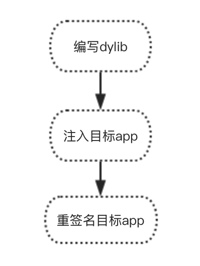
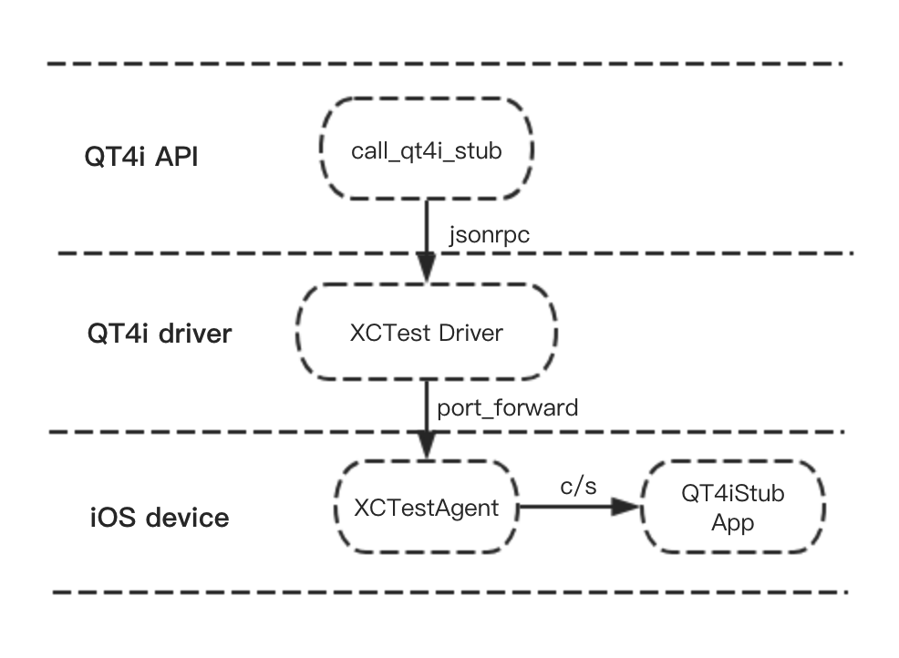
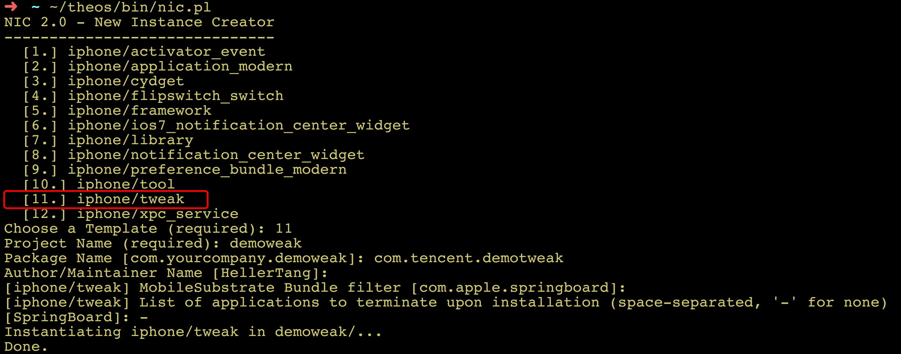
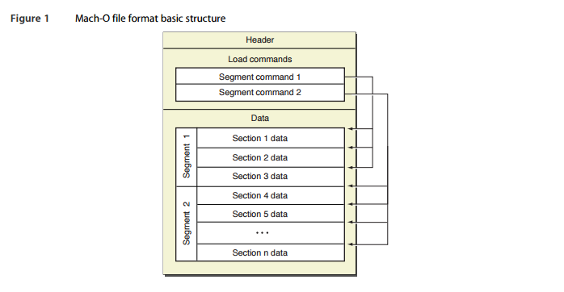
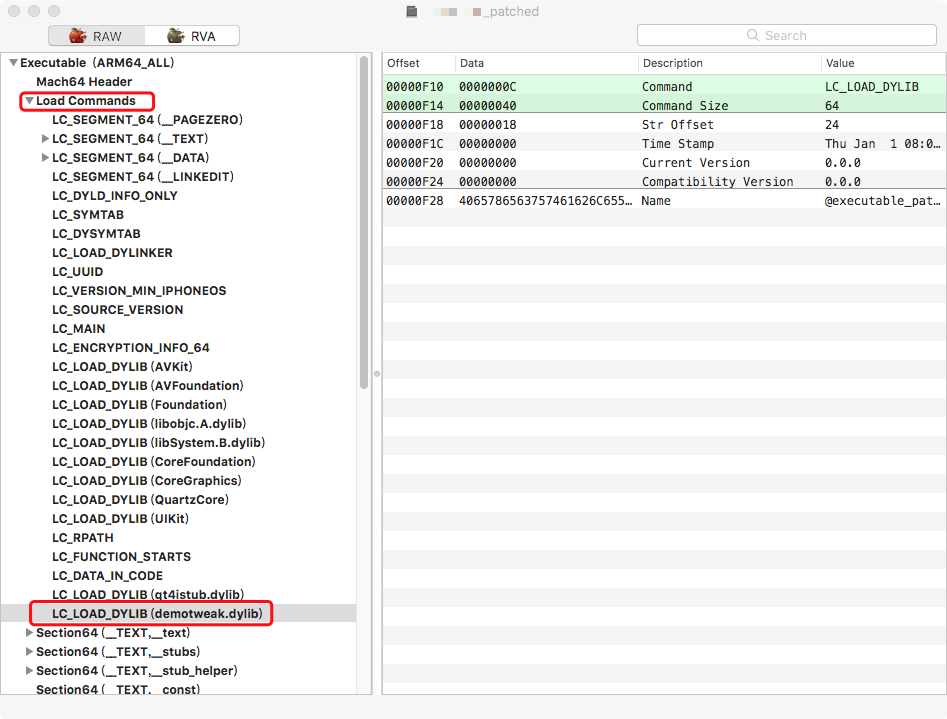

.. include:: ../links/link.ref

插桩特性
========
插桩特性是指通过对被测App注入代码，提高App可测性的一种方式。目前主流的插桩方法有以下两种：

*   静态插桩：在已有目标App源码的前提下，加入实现的framework代码一起编译；
*   动态插桩：在没有目标App源码的前提下，通过一些技术手段实现对目标app的ipa安装包的修改，再将修改后的app安装到手机设备上，从而改变目标app的表现行为。

这是一种侵入式自动化测试方案，使用合适，可以获得理想的效果。

目前，qt4i在 :class:`qt4i.device.Device` 中提供通用桩的调用接口::

    call_qt4i_stub(method, params, clazz=None)
        '''QT4i Stub通用接口

        :param method: 函数名
        :type method: str
        :param params: 函数参数
        :type params: list
        :param clazz: 类名
        :type clazz: str
        :return: 插桩接口返回值
        :rtype: str
        '''

-------
应用场景
-------
QT4i是基于Apple官方提供的XCTest框架实现的，受限于XCTest和被测app之间的通信是跨进程的方式，很多基于被测app内部信息的测试场景就无法覆盖。

而插桩的测试方案很好的弥补了XCTest的不足，因为插桩保证了测试进程和被测app是同一进程（即进程内），可以方便采集被测app的内部信息，依据测试需要修改被测app的状态等。

下面列举出几种插桩在qt4i自动化测试的典型应用：

*   app的沙盒访问：读取沙盒目录， 清除登录态文件；(对比利用itunes私有协议访问沙盒，插桩方案更可靠稳定，访问效率更高)

*   访问系统相册：上传图片，比对图片；(由于系统相册中的图片iOS系统进行了加密，无法直接访问，此时插桩可以轻松实)

*   获取自动化测试资源；(譬如自动化用例需要一些比较大的视频文件，相比于在mac上下载后，通过usb传输到手机，让手机上app主动下载是效率更好的方式，插桩便可以实现)

*   动态修改当前窗口某控件的属性；

*   读取当前窗口控件的详细数据；

-------
如何扩展QT4i通用桩
-------

上图是如何扩展QT4i通用桩，实现调用App进程内方法的流程图。主要分为3个步骤，下面以 :class:`qt4i.device.Device.download_file` 中，基于通用桩接口实现的大文件下载方法为例，介绍如何扩展QT4i通用桩::

1 、扩展QT4iStub方法, 在QT4iStub工程目录下QT4iManager.m文件中实现如下方法::

    - (BOOL) createFile:(NSString *)filename withPath:(NSString *)path size:(NSInteger)size
    {
            .......实现文件下载逻辑.........
    }

将扩展后的QT4iStub制作成framework，便可以开始插桩了。

2、对目标App进行插桩，按需分为静态插桩和动态插桩。

* 静态插桩

将上述扩展后的framework直接加入App源码中，同时需要在app启动调用函数中加入以下注释提示的一行代码，用于启动插桩的server::

    #import <QT4iStub/QT4iStub.h>

    @implementation AppDelegate

    - (BOOL)application:(UIApplication *)application didFinishLaunchingWithOptions:(NSDictionary *)launchOptions {

        ViewController * vc = [[ViewController alloc] init];
        .................................
        .................................
        [self.window makeKeyAndVisible];
        [[QT4iManager sharedManager] startExplorer];  //需要加入的代码
        return YES;
    }

和App源码一起编译即可。

* 动态插桩

由上面可知动态插桩，是针对没有源码的情况，通过工具生成dylib，动态注入到App内，并对app进行重签名的方式。主要需要经过以下流程：

*   加入上述扩展后的framework，制作dylib
*   注入目标app，保证目标启动时会加载hook的动态库
*   重签名目标app，保证修改后的app能在非越狱的手机上能安装并正常启动

在插桩原理中会对动态插桩做详细说明。

3、通过在用例中调用qt4i提供的通用桩调用接口（确保传入方法名和参数与测试桩保持一致），便可实现调用QT4i Stub扩展的方法::

     def download_file(self, file_url, dst_path):
        '''从网上下载指定文件到本地

        :param file_url: 文件的url路径，支持http和https路径, 需要对app插桩
        :type file_url: str
        :param dst_path: 文件在手机上的存储路径，例如：/Documents
        :type dst_path: str
        '''
        method = 'createFile:withPath:size:'
        params = [file_url, dst_path, 1]
        self.call_qt4i_stub(method, params)

.. note:: QT4i Stub是可扩展的，只需按照上述流程，实现所需方法，对目标App进行插桩即可。调用时，需要注意传入对应方法名和参数。

-------
插桩原理
-------
最后，介绍QT4i通用插桩的实现原理，流程图如下：

QT4i框架设计自上而下是API层、driver层和device层:

针对插桩，在API层提供call_qt4i_stub方法，传入参数和方法名或类名，通过rpc通信发送给driver层，再经过端口转发，通过usb发送给iOS设备上(device层)拉起的XctestAgent。
在iOS设备上，XctestAgent作为client端，将信息发送给APP加载时启动的QT4iStub Server端，从而达到调用APP进程内的方法的目的。

这里，着重介绍下动态插桩原理，以上节扩展通用桩为例:

① 首先，通过工具《|theos|_》或《|monkey|_》创建iOS tweak工程，以theos为例：

.. note:: 何为tweak? Tweak实质上是iOS平台的动态库，以dylib这种形式存在，类似Windows 下的 .dll，Linux 下的 .so。与静态库相反，动态库在编译时并不会被拷贝到目标程序中，目标程序中只会存储指向动态库的引用，等到程序运行时，动态库才会被真正加载进来。

然后，将扩展的QT4iStub framework加入到上图生成的tweak工程中的，打开工程目录下的Tweak.xm文件，加入以下代码， 确保app启动时，启动插桩的server::

    #import <QT4iStub/QT4iStub.h>
    #import <objc/runtime.h>

    __attribute__((constructor)) static void entry() {
        NSLog(@"QT4iManager starting...");
        [[QT4iManager sharedManager] startExplorer];
    }

如果需要hook源码中的某个方法，可以使用theos提供的一套《|logos|_》命令，编写hook方法的具体内容。譬如，希望目标App退出后台的时候打印一条日志，可以在Tweak.xm文件中继续追加如下代码::

    %hook AppDelegate

    // Hooking an instance method with an argument.
    - (void)applicationDidEnterBackground:(UIApplication *)application {
        NSLog(@"App entered background!!!");
        %orig; // Call through to the original function with its original arguments.
    }
    %end

只需直接在Tweak工程下面make一下，便可以生成所需的dylib文件的。

.. note:: 何为Logos？在Logos命令背后，theos定义了一系列的宏和函数，底层利用objective-c的runtime特性来替换系统或者目标app的函数(Method Swizzling)，从而实现对目标app的hook。

② 为了保证目标app运行时加载生成的dylib，必须保证app中存储有指向生成的dylib的引用，其实就是修改目标app的二进制文件。

在修改之前，先了解下iOS中Mach-O可执行文件的格式，如图:

*   Mach-O头部（mach header）:描述了Mach-O的cpu架构、文件类型以及加载命令等信息。
*   加载命令（load command）:描述了文件中数据的具体组织结构，不同的数据类型使用不同的加载命令表示。
*   Data: Data中的每个段（segment）的数据都保存在这里，段的概念与ELF文件中段的概念类似。每个段都有一个或多个Section，它们存放了具体的数据与代码。

了解了Mach-O文件格式后，便明白我们只需在目标app的可执行文件的Load Command部分添加一个加载命令LC_LOAD_DYLIB指向生成的dylib，便可以使目标app启动时可以加载生成的dylib，这里推荐使用《|insert|_》工具实现。成功后，可以使用《|machoview|_》工具查看如下:

③ 最后使用证书对上述文件进行重签名就可以了，重签名工具很多，这里使用《|appsigner|_》操作步骤如下：

*   使用codesign -fs +证书 + dylib命令，对生成dylib进行重签名；
*   将重签名后的dylib放入目标App解压后的Payload/app名的目录下；
*   使用重签名工具，对整个安装包使用有效的证书重签名；

.. warning:: 重签名证书一定要使用花钱买的个人开发者证书或者企业证书！
