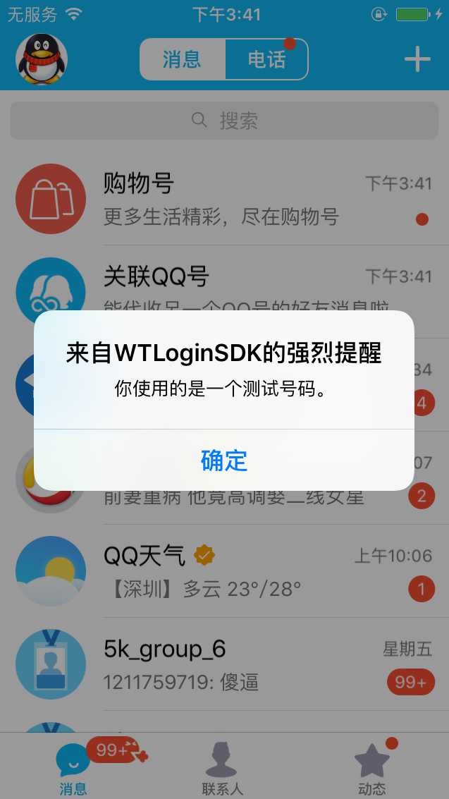
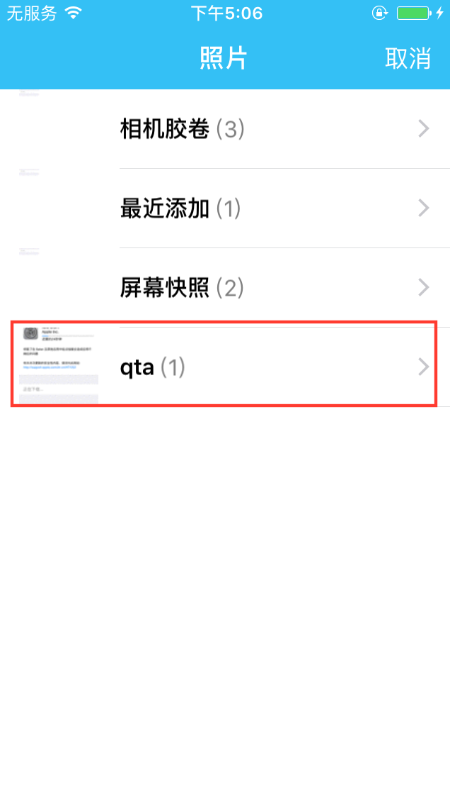
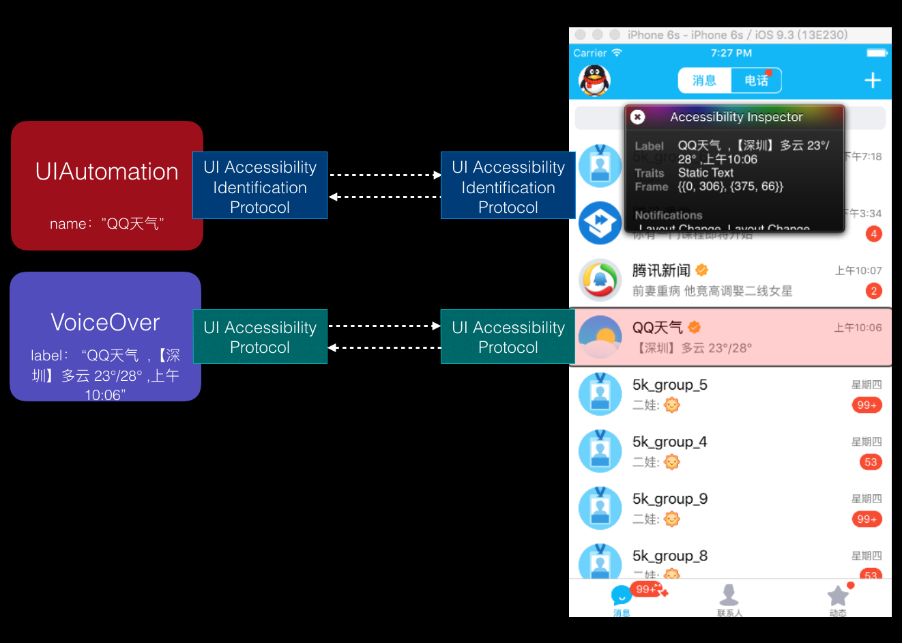
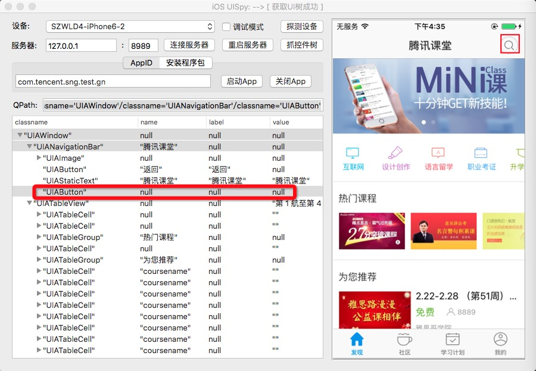
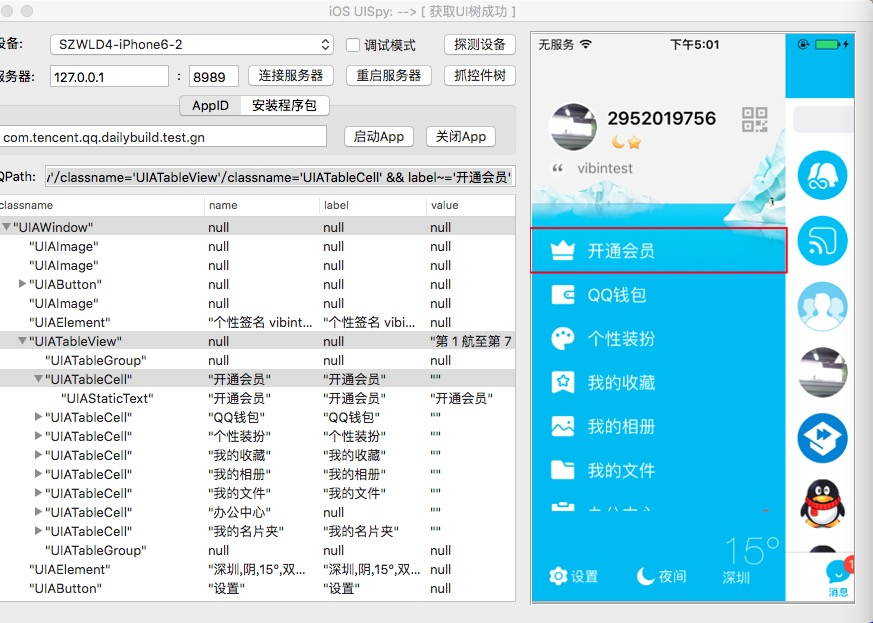
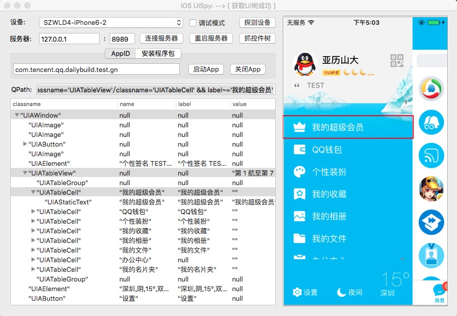
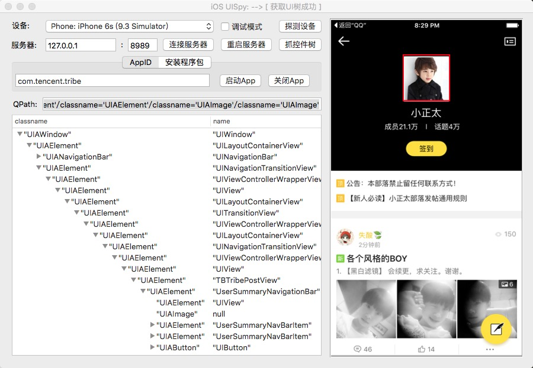

App自动化可测性提升
===========

======
什么是可测性
======
软件测试中的可测性（testability）一般是指对系统的可控性、可观察性、可隔离性以及稳定性等进行的衡量评估，借以反映系统设计、实现
对测试的友好程度和相应的测试成本。具体到iOS App的UI自动化测试中，主要体现在iOS App自身行为的稳定性以及控件的可识别性上。下面
将从这两个维度探讨如何提升iOS App的可测性。

===============
如何提升iOS App的可测性
===============
俗话说，巧妇难为无米之炊。UI自动化测试工作也是同样道理，QT4i为我们提供了简单易用的平台工具，但是作为被测对象的iOS App
本身并不具备可测性，那我们也很难顺利开展自动化测试工作，所以，提升iOS App的可测性显得尤为重要。

-----------------------
排除iOS App的外部干扰，提升自身的稳定性
-----------------------
iOS App作为UI自动化的被测对象，自身行为的稳定性直接决定了UI自动化效果的好坏。所以，UI自动化需要聚焦App的功能特性，尽量
排除外部因素的干扰。下面介绍一些常用的提升iOS App自动化稳定性的方法。

1. 屏蔽App交互中的干扰行为。例如：iOS App使用测试帐号时，后台策略会在交互过程中额外出现测试弹框提醒（该类弹框并非业
务本身的功能特性，而且用例脚本中自动处理这类弹框不稳定），针对这类弹框，最有效的手段是通过wtlogin后台配置策略，屏蔽
掉被测App中的此类弹框；对于iOS App启动时的推送通知授权弹框，则可以考虑在客户端代码中屏蔽掉，有效避免因推送通知授权弹框
的出现过早导致的测试用例失败。

2. 初始化环境，保证测试环境的一致性。例如：清理测试帐号的登录态，保证每次启动App都是未登录的状态。

3. 统一预置条件，保证交互的一致性。例如：涉及选取文件的操作（发送文件或者上传图片等），由于文件生成本身不是测试点，可以考虑
在iOS测试机器上的图库中预置相同名称的文件夹和相同数量的照片作为测试资源（对于文件大小有要求的可以预置一些视频文件），以此保
证选取文件的UI操作的一致性和稳定性。

-------------------------
初探accessibility，提升控件的可识别性
-------------------------
对于iOS App的系统测试同学，大都知道VoiceOver阅读功能和 **accessibility** 属性之间的映射关系，但是UI自动化和accessibility
之间又有着怎样的千丝万缕的联系呢？下面我们一起走进accessibility的世界，探讨提升iOS App的控件可识别性的有效途径。

^^^^^^^^^^^^^^^^^^^^^^
iOS accessibility的基本介绍
^^^^^^^^^^^^^^^^^^^^^^

iOS accessibility的相关属性由两个常见的协议组成（UIAccessibility Protocol和UIAccessibilityIdentification Protocol），
VoiceOver使用了UIAccessibility Protocol，UI自动化的测试框架UIAutomation则同时使用了两个协议，如下图所示。

这两个协议包含了accessibility很多属性，详见 `苹果官方指南 <https://developer.apple.com/accessibility/ios/>`_ ，
这里我们重点介绍和UI自动化相关的四个属性：

 * accessibilityIdentifier（自动化的专属控件属性，对应UISpy中控件的name属性）
 
 
 * accessibilityLabel（VoiceOver和自动化公用的控件属性，对应UISpy中控件的label属性）
 
 
 * accessibilityValue（VoiceOver和自动化公用的控件属性，对应UISpy中控件的value属性）
 
 
 * accessibilityTraits（VoiceOver和自动化公用的控件属性，决定UISpy中控件的显示类型）
 
其中，accessibilityIdentifier是作为识别控件的首选属性，因为它既不会影响VoiceOver的阅读功能，也不会随着无障碍化需求
的变更发生变化（稳定性较好）；accessibilityLabel直接对应VoiceOver的文本内容（随着无障碍化需求的变更而变化），可以作
为控件识别的补充属性；accessibilityValue通常用于存放动态的内容，则适于作为已知控件的合法性校验属性。accessibilityTraits
属性通常情况下不用单独设置，默认会关联上一个标准控件类型，对于自定义的控件，如果没有显式给出控件类型，
可以考虑 `设置accessibilityTraits属性 <https://developer.apple.com/library/ios/documentation/UIKit/Reference/UIAccessibility_Protocol/index.html#//apple_ref/doc/constant_group/Accessibility_Traits>`_ 。

^^^^^^^^^^^^^^^^^^^^^
iOS accessibility最佳实践
^^^^^^^^^^^^^^^^^^^^^

下面结合几个典型场景，给出提升控件的可识别性的最佳实践。
  
* 控件类型不能唯一标识控件::
   
   QPath:  /classname=‘UIAWindow’/classname=‘UIAButton‘

【解决方法】iOS App代码中设置控件的accessibilityIdentifier属性（见下图的objective-c代码），
结合控件类型和控件name属性作为控件的QPath。

.. code-block:: objective-c

   customView.accessibilityIdentifier = @"搜索";
   
   
.. code-block:: python
   
   设置后的QPath:  /classname=‘UIAWindow’/classname=‘UIAButton‘ & name=‘搜索’ 
   
* 控件的label属性动态变化::

   QPath: 
   /classname=‘UIAWindow’/classname=‘UIATableView’/classname=‘UIATableCell’ & label=‘开通会员’
   /classname=‘UIAWindow’/classname=‘UIATableView’/classname=‘UIATableCell’ & label=‘我的会员’
   /classname=‘UIAWindow’/classname=‘UIATableView’/classname=‘UIATableCell’ & label=‘我的超级会员'

【解决方法】App代码中设置控件的accessibilityIdentifier属性（设置方法同上），用控件name属性替换label属性作为控件的QPath::
   
   设置后的QPath:  /classname=‘UIAWindow’/classname=‘UIATableView’/classname=‘UIATableCell’ & name=‘会员中心’
   
* 内嵌webview（H5页面）的控件如何识别

【解决方法】目前UI自动化提供了两种识别手段

(1) 映射为native控件的方式：有text标签的，accessibilityLabel自动继承text内容，无需单独设置；无text标签的（如input、image），需要通过添加aria-label属性即可。

.. code-block:: html

   

(2) QT4W(正在开源中)：设置webview页面的标题（确保唯一性），用于webview的识别。
   
综上，提升iOS控件的可识别性的最佳实践为:
   
   1. 优先设置iOS控件的accessibilityIdentifier属性（控件id），并将其作为QPath中的识别控件的首选属性；
   
   2. iOS App的UI主界面的入口控件或者通用控件的accessibilityIdentifier属性尽量固化下来，保持不变，例如：
      iPhoneQQ中的会员入口控件、AIO会话窗口的返回按钮等；
   
   3. 对于hybrid App, 优先考虑采用QT4W识别WebView，保证WebView的标题唯一性。
   

-----------------------------
玩转iOS的黑魔法，揭秘iOS App控件id自动生成方案
-----------------------------
在熟悉了accessibility的来龙去脉之后，我们知道如何灵活地给被测App加上控件id。但是问题来了，全部控件的属性是不是都需要
一个一个手工添加，开发表示时间紧迫，鸭梨山大。特别是对于一个全新的App，开发初期没有考虑这些需求，控件属性基本都为空白。
有没有一枚“银弹”，可以快速补全这些控件id呢？答案是肯定的，下面就来揭晓如何自动生成iOS的控件id。

^^^^^^^^^^^^
剖析控件id自动生成原理
^^^^^^^^^^^^
这里所说的iOS黑魔法就是Method Swizzling，它是利用Objective-C的运行时特性，改变或者扩展原有的函数功能，实现对原有代码的注入。
控件id自动生成正是利用这个特性，动态替换UIView类的accessibilityIdentifier方法，加入控件id的生成规则，最终实现自动添加控件控件id。
下面具体介绍Method Swizzling的操作步骤。

* 实现指定函数的扩展功能（自由发挥）

.. code-block:: objective-c

 - (void)swizzled_viewDidAppear:(BOOL)animated
 {
     // 调用原方法
     [self swizzled_viewDidAppear:animated];  // 此处不是递归调用，在运行时会被替换成原方法 
     // 扩展功能，此处仅打印日志
     NSLog(@"swizzled:%@",NSStringFromClass([self class]));
 }

* 替换原有函数（标准模板）

.. code-block:: objective-c

 + (void)swizzleMethods:(Class)class originalSelector:(SEL)origSel swizzledSelector:(SEL)swizSel
 {
     Method origMethod = class_getInstanceMethod(class, origSel);
     Method swizMethod = class_getInstanceMethod(class, swizSel);

     BOOL didAddMethod = class_addMethod(class, origSel, method_getImplementation(swizMethod), method_getTypeEncoding(swizMethod));
     if (didAddMethod) {
         //原方法不存在，而是继承了父类的实现，则将父类的实现替换到swizMethod中，从而实现在swizMethod对父类方法的调用
         class_replaceMethod(class, swizSel, method_getImplementation(origMethod), method_getTypeEncoding(origMethod));
     } else {
         //原方法已存在，直接交换方法
         method_exchangeImplementations(origMethod, swizMethod);
     }
 }

* 寻找注入时机，加载新功能（load方法在类加载时会被自动调用一次)

.. code-block:: objective-c

   + (void)load
   {
      SEL origSel = @selector(viewDidAppear:);
      SEL swizSel = @selector(swiz_viewDidAppear:);
      static dispatch_once_t onceToken;
      dispatch_once(&onceToken, ^{
        [UIViewController swizzleMethods:[self class] originalSelector:origSel swizzledSelector:swizSel];
      }); 
   }

更多Method Swizzling请参考 `这里 <http://nshipster.com/method-swizzling/>`_

^^^^^^^^^^^
介绍控件id的生成规则
^^^^^^^^^^^

通常情况下，由于UIAutomation只关注控件树中的叶子节点对应的控件的可操作性以及属性，所以UIAutomation的UI控件树的层次结构
并不是严格对应代码中UI控件结构，而是代码中控件树的简化版。所以，如果让代码中的全部UI控件显示在UIAutomation的控件树中将会
导致控件树的过度庞大，影响UI控件的查找效率，如下图所示。

因此，选择合适的id生成规则就显得尤为重要，具体规则按优先级排列如下：

1. Id（accessibilityIdentifier）不为空，也即id内容在代码已经设置，直接返回该id即可；

2. 若id为空，则选择UI控件实例的变量名作为控件id，具体获取方法如下（利用runtime的接口，遍历当前view的superview，获取当前view实例的变量名）；
  
.. code-block:: objective-c

   - (NSString *)getVarNameWithInstance:(UIView *) instance {
       unsigned int numIvars = 0;
       NSString *key=nil;
       Ivar * ivars = class_copyIvarList([self class], &numIvars);
       for(int i = 0; i < numIvars; i++) {
           Ivar thisIvar = ivars[i];
           const char *type = ivar_getTypeEncoding(thisIvar);
           NSString *stringType =  [NSString stringWithCString:type encoding:NSUTF8StringEncoding];
           if (![stringType hasPrefix:@"@"]) {  // 过滤掉非OC类型
               continue;
           }
           if ((object_getIvar(self, thisIvar) == instance)) {
               key = [NSString stringWithUTF8String:ivar_getName(thisIvar)];
               break;
           }
       }
       free(ivars);
       return key;
   }

【说明】针对UIImageView，需要单独hook accessibilityLabel以实现accessibilityIdentifier属性的设置。  

 
3. 若步骤2中的UI控件的实例变量名为空时，可以枚举以下常用UI控件单独生成id内容：

1） UILabel：使用text作为id

2） UIButton：使用titleLabel.text作为id

3） UIImageView：使用image的文件名作为id（此处需要hook image的加载函数）

4） 其他app自定义的UI控件待补充   