.. include:: links/link.ref

快速入门
====

====
测试项目
====

测试用例归属于一个测试项目，在设计测试用例之前，如果没有测试项目，请先参考《|project|_》。按照该指引你可以创建一个例如名称为”demo”的项目。

======
安装QT4i
======

qt4i的正常使用依赖《|fbsimctl|_》工具，首先需要安装fbsimctl:

.. code-block:: shell

      $ brew tap facebook/fb

      $ brew install fbsimctl --HEAD

然后安装qt4i:

.. code-block:: shell

	$ pip install qt4i

.. _intro_xctestagent:
    
===================
部署XCTest Driver运行环境
===================

1. 调用测试项目的manage.py命令，解压并自动打开XCTestAgent的工程:

.. code-block:: shell

	$ python manage.py qt4i.setup
   

如果没有创建测试项目，也可以执行qt4i-manage命令代理上述命令：

.. code-block:: shell

   $ qt4i-manage setup

.. note:: XCTestAgent工程默认存放路径为 “~/XCTestAgent” 。

2. 选择“Build Settings”>“Code Signing”一栏。

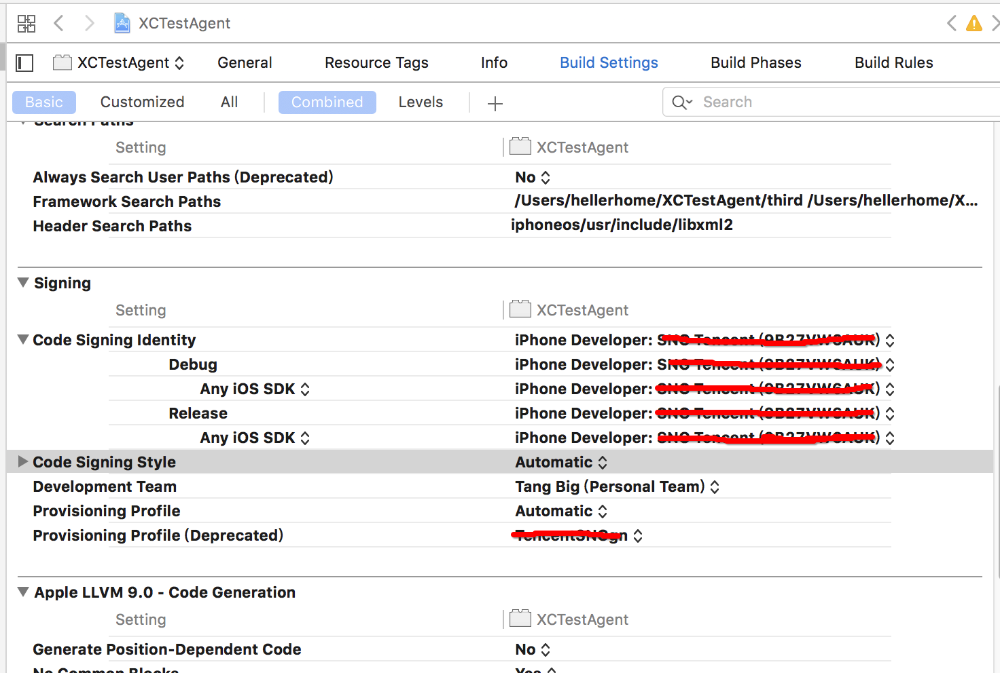

全部修改为“Automatic”>“iOS Developer”，当成功添加了Apple ID后，签名会自动变为该ID对应的签名证书。

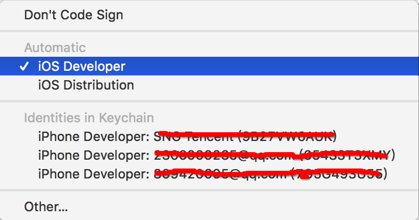

3. 选择“Build Settings”>“Packaging”一栏，修改“Product Bundle Identifier”的值，要求bundle id不能重复，建议将自己的名字作为后缀以区分（【注意】：不要出现下划线 )。

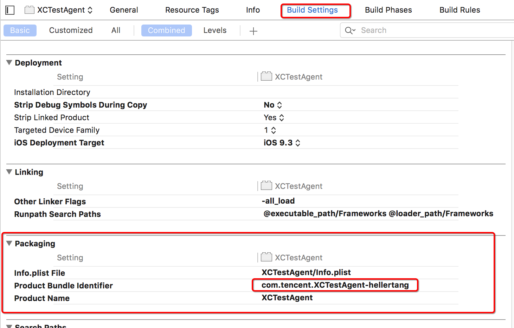

4. 选择“Build Settings”>“General”一栏， 勾选“Automatically manage signing”，此时应该没有任何错误提示(如果第3步中，后缀名出线下划线，会提示第二张图的错误)。

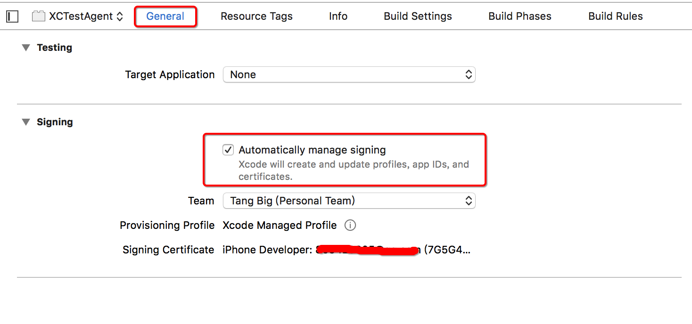

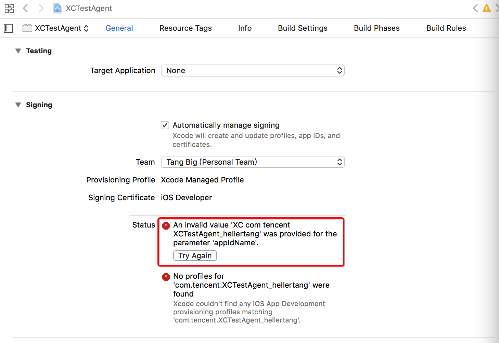

5. 选择“Product”>“Test”，构建及运行XCTestAgent。

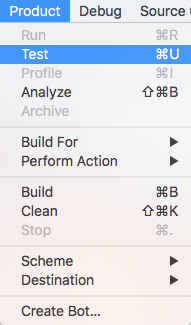

6. 如果出现如下弹框，显示签名失败，选择“Fix issue”，然后添加一个Apple ID账户，选择该账户作为个人开发团队。

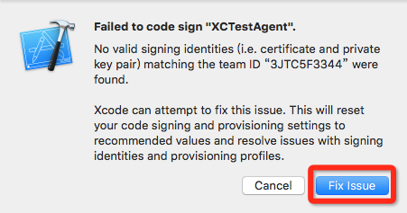

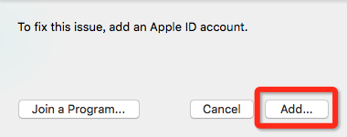

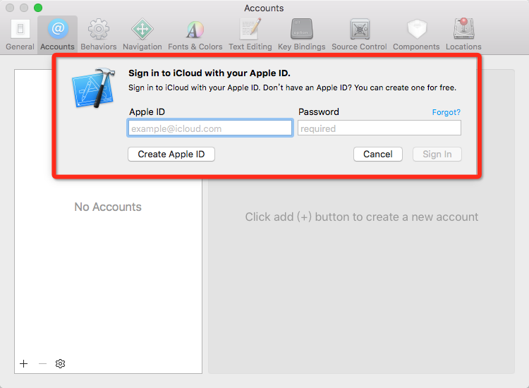

7. 如果出现如下弹框，需要在iPhone上设置该账户为信任开发者。

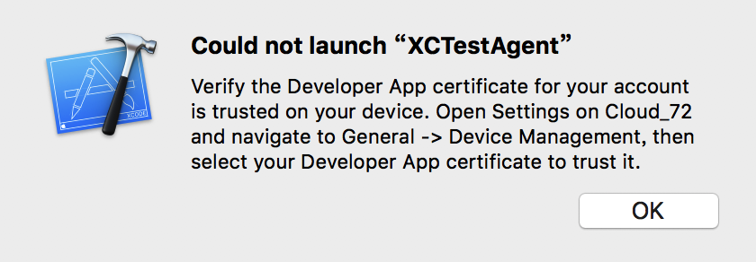

进入iPhone：“通用”>“设备管理”>“开发商应用”，信任该账户开发者。

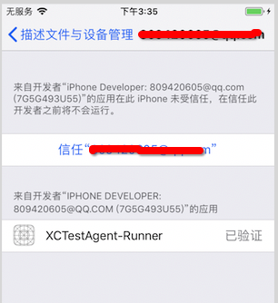

8. 如果出现如下弹框，说明bundle id不匹配，将手机上的app删除，再重新运行test。

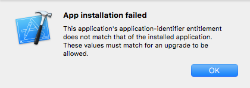

9. 当Xcode test成功运行XCTestAgent，注意Xcode打印的信息，是否出现下图中红框内容，确保XCTestAgent在后台运行；否则需要重启手机，重新运行Xcode test。

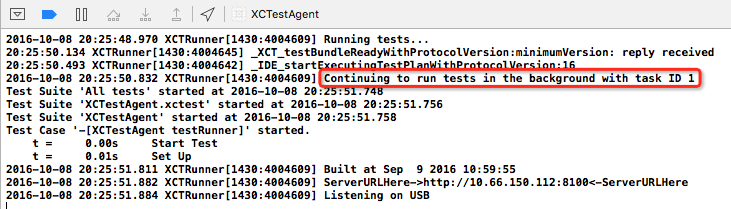

10. 确保Xcode test能正常运行XCTestAgent后，停止运行test，并关闭Xcode。

======
理解UI结构
======

iOS的UI结构涉及三个概念，应用(App)、窗口(Window)、控件(Control):

* **App:** 每一个iOS应用是一个App，即安装到手机上的待测应用，App基类由 :class:`qt4i.app.App` 实现。

* **Window:** 一个App包含多个Window，Window表示一个被测的App窗口界面，我们需要对每个窗口进行定义，以测试目标窗口，窗口基类由 :class:`qt4i.icontrols.Window` 实现 。

* **Control:** 一个Window包含多个Control，即每一个窗口包含了多个控件元素，QT4i中用QPath来查找定位控件，以便对各个控件进行操作。 控件基类由 :class:`qt4i.icontrols.Element` 实现

所以我们需要以QT4i中的实现为基础，针对三种UI元素分别进行封装使用。 

=======
第一个测试用例
=======

至此，运行qt4i所必要的环境，已经搭建完成，也对UI结构也有了一定的理解。

不妨以iOS系统自带的设置应用为例(模拟器和真机都有)，开始写QT4i的第一个用例。

请先参考《|testcase|_》熟悉用例基本结构。由开头可知，我们已经创建了一个名为demo的项目，其中，

- demotest:测试用例集合，这里存储所有测试用例的脚本。
- demolib:测试业务库，这里存放所有测试业务lib层的代码，使得不同用例可以复用demolib的接口。
- settings.py:项目配置文件，可以配置你所需要的项。

demotest目录下会自动生成hello.py文件，我们在该文件实现第一个简单的测试用例::

   from qt4i.device import Device
   from demolib.demotestbase import DemoTestcase
   from demolib.demoapp import DemoApp
   
   
   class DemoTest(DemoTestcase):
       'Demo测试'
   
       owner = 'apple'  # ----------------------------------------# 脚本的设计者
       priority = DemoTestcase.EnumPriority.Normal  # -----------------# 脚本的优先级
       status = DemoTestcase.EnumStatus.Design  # ---------------------# 脚本的状态
       timeout = 5  # -------------------------------------------------# 脚本执行超时值 （分钟）
   
       def run_test(self):
           self.start_step('1、申请资源启动DemoApp')
           device = Device()  # ---------------------------------------# 申请测试设备
           demoapp = DemoApp(device)  # -------------------------------# 启动被测试APP
   
           self.start_step('2、查询设备信息')
           isEnter = demoapp.enter()  # -------------------------------# 进入设备信息页面
           self.assertEqual("检验是否查看成功"， isEnter， True) # --------# 检查是否进入成功
   
           self.start_step('3、修改设备名称')
           name = 'qt4i'
           isModify = demoapp.rename(name)  # -------------------------# 修改设备名称
           self.assertEqual("检验是否修改成功"， isModify， True)  # ------# 检查是否修改成功

.. warning:: 在测试用例中强烈建议只调用lib封装的接口和断言操作，以保证App UI变化用例的逻辑不需要改动，同时也最大限度复用lib封装。

-------
继承于测试基类
-------

首先，用例继承于DemoTestBase测试基类，针对测试基类的封装可以参考《:ref:`encap_testbase`》一节。然后在run_test接口中编写你的测试用例。

----
获取设备
----

获取连接在Mac上的终端设备，利用 :class:`qt4i.device.Device` 类实例化指定设备对象。如果未指定设备则获取链接在Mac上的第一个真机，如果没有真机，则会获取已经启动的模拟器::

   device = Device(udid=None)     # 传入设备udid可以指定使用具体设备

.. warning:: 如果没有连接真机和已经启动的模拟器，则会抛出异常。

-------
实例化App类
-------

申请到设备后，开始实例化你的应用App类，针对DemoApp的封装可以参考《:ref:`encap_app`》一节::

      demoapp = DemoApp(device)   
      
------
业务逻辑操作
------

在用例中只调用业务逻辑接口，而业务逻辑实现在demolib库下的各个文件中。本测试用例是验证修改设备名称是否成功，故此处调用::

      demoapp.enter()    # -------------------------------# 进入设备信息页面
      demoapp.rename(name)      # -------------------------# 修改设备名称

该功能会自动进入设备信息页面，并且修改设备名称。所以接下来验证测试功能点，设备名称是否修改成功::

      self.assertEqual("检验是否修改成功",isModify,True) #------# 检查是否修改成功

至此，一个基本的用例就完成了。
