Q&A
===

记录QT4i使用中的常见问题及解决方案。

=========
1. 手机系统弹框
=========

启动APP失败，报告中显示错误堆栈::

      Fault: <Fault 1: <type 'exceptions.Exception'>:DeviceDisabled>

查看截图

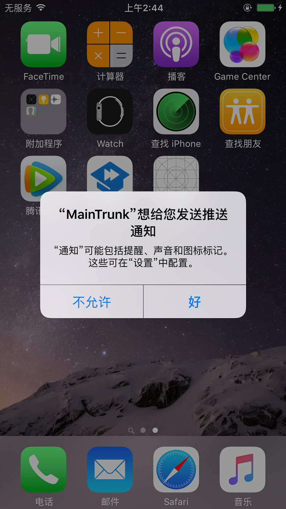

解决方法:

人工点击按钮“好”，关闭弹框

=======
2. 网络问题
=======

用例登录失败

解决方法:

检查手机WiFi连接是否正常，如果未连接网络，需要手动重连。

==================
3. Mac解析hostname异常
==================

运行出现以下错误:

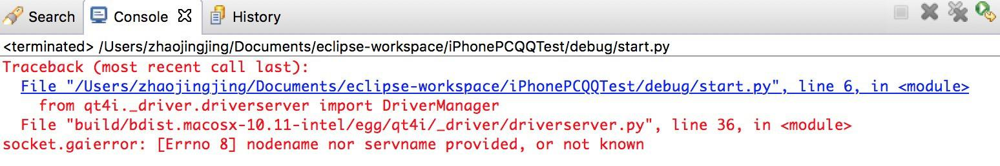

解决方法:
  
* 查看 系统偏好设置->共享->电脑名称，保证“电脑名称”与hostname一致
 
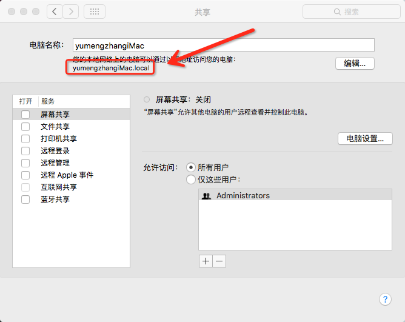
 
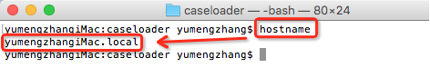
  
* 方法一：
  
* 在终端运行命令：sudo scutil --set HostName newName.local（其中newName.local替换成系统偏好设置->共享查到的如上图所示内容）

* （方法一执行完错误仍在使用方法二）
  
* 方法二：
  
* 前往Macintosh HD -> Library/资源库 -> Preferences -> SystemConfiguration，删除以下文件::

      com.apple.airport.preferences.plist
      NetworkInterfaces.plist
      Preferences.plist

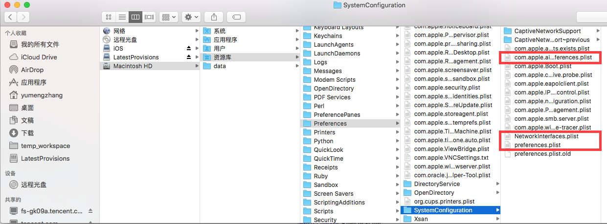

* 重启计算机

==========
4. 端口被占用异常
==========
 本地调试用例时，出现Address already in use异常::
 
   File "build/bdist.macosx-10.13-intel/egg/qt4i/driver/rpc.py", line 41, in __call__
     return self.method.__get__(self.instance, self.owner)(*args, **kwargs)
   File "build/bdist.macosx-10.13-intel/egg/qt4i/driver/xctest/wda.py", line 95, in dismiss_alert
     self.agent.execute(Command.QTA_ALERT_DISMISS, env)
   File "build/bdist.macosx-10.13-intel/egg/qt4i/driver/xctest/wda.py", line 69, in __get__
     val = self.func(instance)
   File "build/bdist.macosx-10.13-intel/egg/qt4i/driver/xctest/wda.py", line 108, in agent
     return self.agent_manager.get_agent(self.udid)
   File "build/bdist.macosx-10.13-intel/egg/qt4i/driver/xctest/agent.py", line 125, in get_agent
     return self.start_agent(device_id)
   File "build/bdist.macosx-10.13-intel/egg/qt4i/driver/xctest/agent.py", line 91, in start_agent
     self._agents[device_id] = XCUITestAgent(device_id, server_ip, server_port, keep_alive, retry, timeout)
   File "build/bdist.macosx-10.13-intel/egg/qt4i/driver/xctest/agent.py", line 189, in __init__
     self.start(retry, timeout)
   File "build/bdist.macosx-10.13-intel/egg/qt4i/driver/xctest/agent.py", line 287, in start
     self._tcp_relay()
   File "build/bdist.macosx-10.13-intel/egg/qt4i/driver/xctest/agent.py", line 205, in _tcp_relay
     raise self._relay_error
   error: [Errno 48] Address already in use

解决方法 ：

①可通过命令查看8100端口被哪个进程占用::

    $ lsof -i :8100
 
②根据进程PID ，kill掉占用进程::

    $ kill -9 （进程PID）
   
③重新跑用例即可。

==============
5. UISpy连接失败报错
==============
打开UISpy，点击连接，报错::

   File "build/bdist.macosx-10.13-intel/egg/qt4i/driver/rpc.py", line 64, in _dispatch
     return m(*params)
   File "build/bdist.macosx-10.13-intel/egg/qt4i/driver/rpc.py", line 41, in __call__
     return self.method.__get__(self.instance, self.owner)(*args, **kwargs)
   File "build/bdist.macosx-10.13-intel/egg/qt4i/driver/host.py", line 65, in list_devices
     return DT().get_devices()
   File "build\bdist.win32\egg\testbase\util.py", line 158, in __call__
   File "build/bdist.macosx-10.13-intel/egg/qt4i/driver/tools/dt.py", line 77, in __init__
     self.xcode_version = DT.get_xcode_version()
   File "build/bdist.macosx-10.13-intel/egg/qt4i/driver/tools/dt.py", line 96, in get_xcode_version
     raise Exception('get_xcode_version error:%s' % e.output)
   Exception: get_xcode_version error:xcode-select: error: tool 'xcodebuild' requires Xcode, but active developer directory '/Library/Developer/CommandLineTools' is a command line tools instance

命令行中可查看系统默认XCode安装路径::

   $ xcode-select -p
   /Library/Developer/CommandLineTools

正常的Xcode路径应该是::

   /Applications/Xcode.app/Contents/Developer
   
解决办法:

使用如下命令切换Xcode为正确路径：::

   $ sudo xcode-select -s  +Xcode路径
   （备注：Xcode路径可以将xcode直接拖入Terminal终端）

切换完之后，可以通过命令确认::
   
   $ xcode-select -p

=========
6. 磁盘空间不足
=========

Xcode运行会产生大量日志文件，导致Mac机器磁盘空间不足:

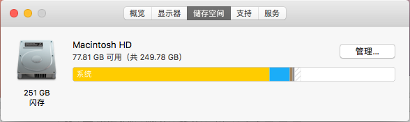

命令行，进入Xcode的缓存目录DerivedData::

      $ cd ~/Library/Developer/Xcode/DerivedData/

可以看到该目录下有一个以“XCTestAgent”开头的目录，后缀是随机生成的字符串:

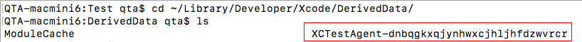

直接删除该目录下的子目录/Logs/Test下的全部文件:

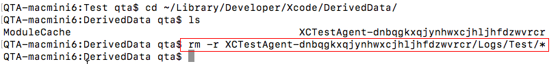

====================
7. 由于信任文件问题导致的手机安装错误
====================

使用qt4i的install接口安装App报错，日志堆栈如下:

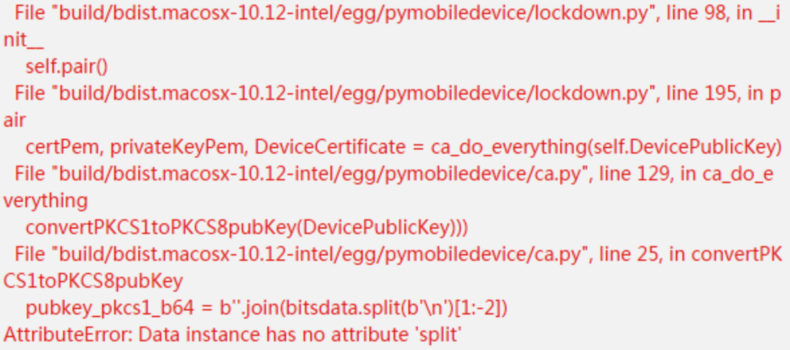

这是因为iPhone手机信任Mac后在本地缓存的密钥对失效，所以要重新信任。进入缓存目录::

      $ cd ~/.pymobiledevice/

清理目录下的所有文件:

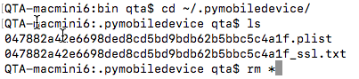

重新插拔手机，会弹出信任弹框，选择“信任”:

===================
8. 如何阻止iOS设备的系统升级弹窗
===================

iOS设备的系统升级弹窗频繁出现会影响自动化任务，如何在不升级系统的情况下关闭升级弹窗提醒，具体参考如下方法:

1、在手机上打开safari，地址栏输入::

   https://beta.thuthuatios.com/tvos12/tvOS_12_Beta_Profile.mobileconfig
   
2、回车之后按照要求安装此provision文件即可，最后重启手机即可。

==================
9. XCTestAgent编译报错
==================

由于USB插口问题，导致连接通道请求被拒绝，可以通过更换USB插口解决该问题。

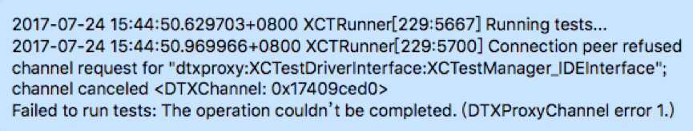

========================
10. UISpy或者Eclipse安装打开报错
========================

若当前Mac系统为10.12及以上版本，则首次有可能出现某些安装包已损坏、显示未激活、打开崩溃等的提示！原因是因为新系统屏蔽了任何来源的设置，
需要大家打开“允许任何来源”方可安装，具体步骤如下：

- 打开命令行终端——Spotlight搜索(快捷键：command+空格或右上角搜索的符号)：搜索“终端”
- 输入命令，回车后输入你的Mac电脑密码::

   sudo spctl --master-disable
   
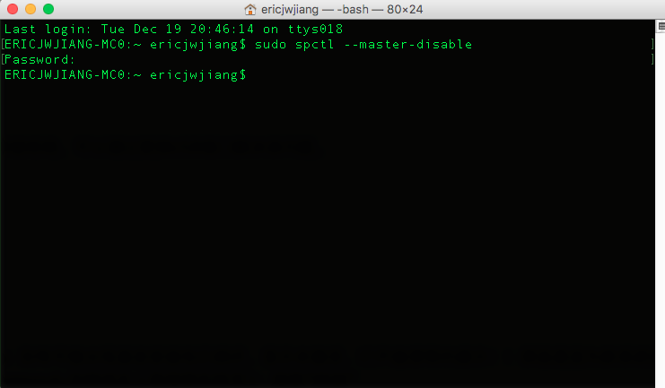

- 回到系统偏好设置的“安全与隐私”，勾选“允许任何来源”

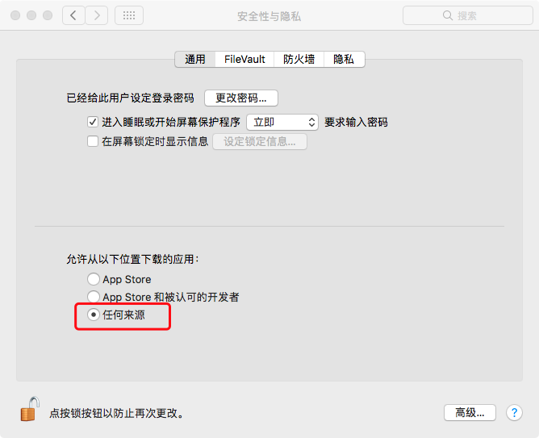

- 如果以上步骤依旧不行，请将app移到 **"/Applications"** 目录。
