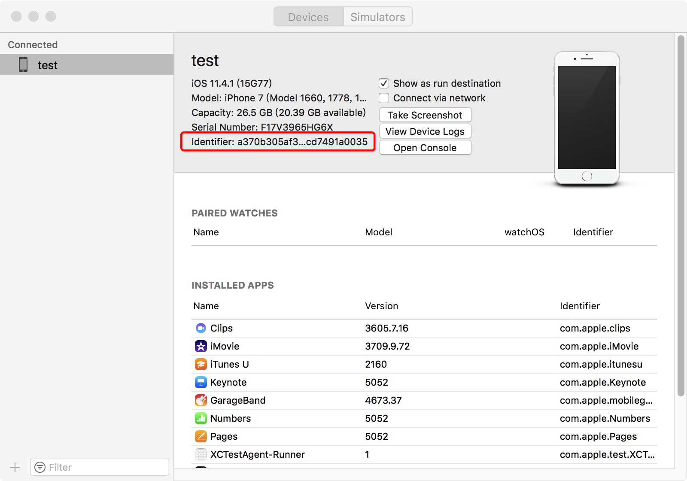
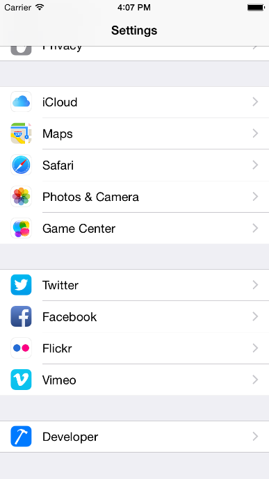
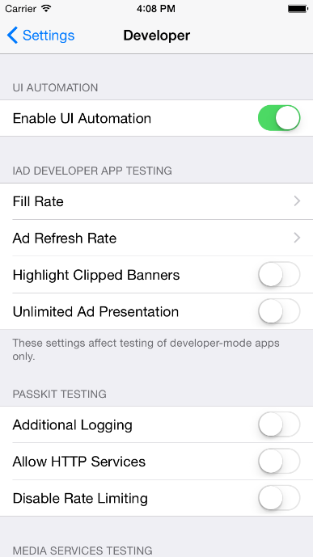

.. include:: links/link.ref

使用前准备
=====

QT4i依赖QTAF模块，使用前请参考《|setup|_》一节。
   
=======
准备Mac电脑
=======

QT4i的测试需要在Mac上执行，需要准备一台Mac并符合以下要求：

 * 操作系统为：Mac OS X EI Capitan（版本10.11.6及以上，推荐升级到最新版本）
 
 * 下载QT4i相关的工具

.. list-table:: QT4i工具清单
   :widths: 10 30
   :header-rows: 1
   :align: center

   * - 工具名称
     - 说明
   * - |iosuispy|_
     - 查看App的控件树以及控件QPath的工具，解压即可使用
   * - QTA-IDE
     - Python脚本开发环境(可选择自己喜欢的IDE)
   * - Xcode
     - QT4i依赖的xctest底层工具，Xcode6及以下不支持

=======
准备iOS设备
=======

QT4i至少需要一台iOS设备，可以是真机或模拟器。

-------
使用iOS真机
-------

1. 通过USB连接iOS设备到Mac，初次连接时需要等待手机“是否信任此电脑”的弹框，点击“信任”。

2. 查询iOS设备的设备标识符UDID
   
 打开Xcode, 依次进入菜单Window->Devices and Simulators，查询获取iPhone手机的UDID，如下图所示：
 

3. 打开UI Automation功能

--------
使用iOS模拟器
--------

1. 启动iOS模拟器(没有的话，可以新建)

2. 打开UI Automation功能，方法同真机的方式。

 
