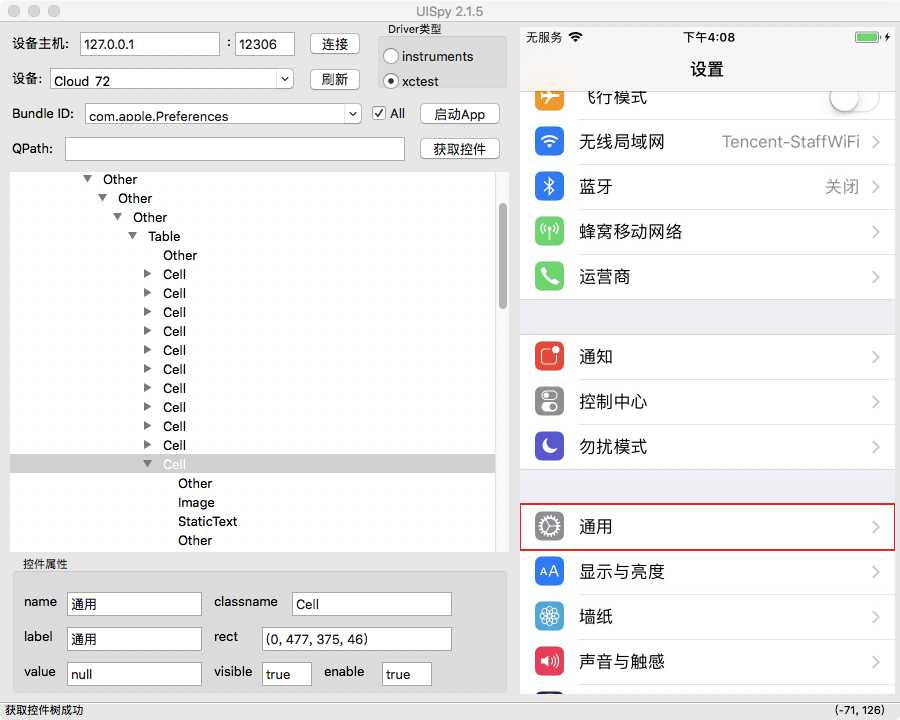
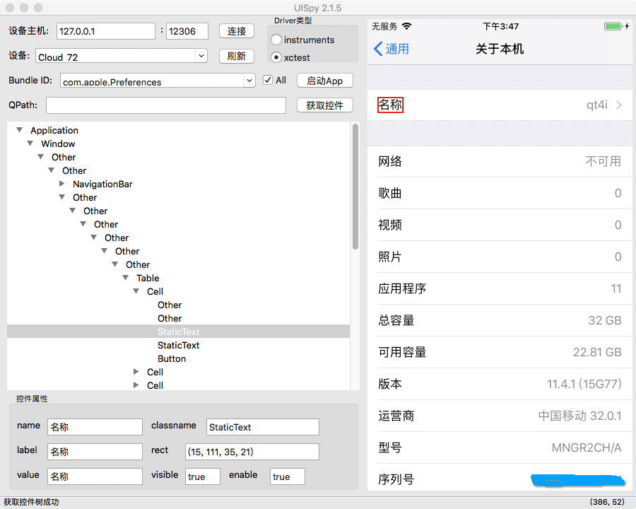
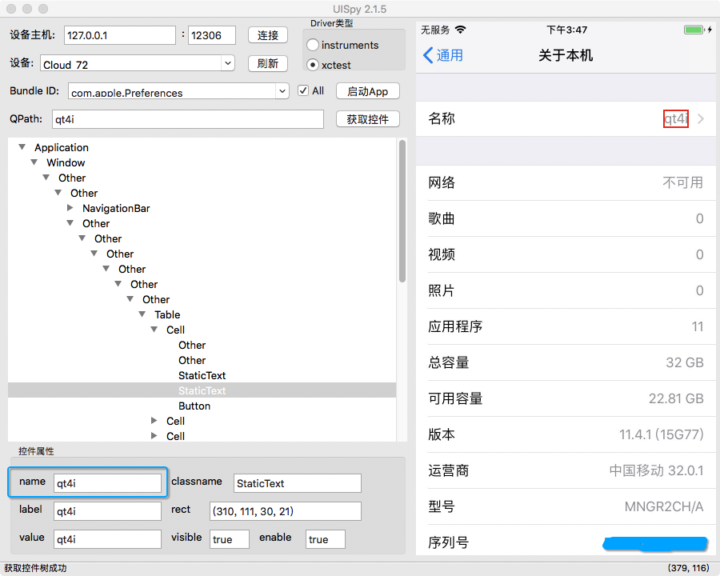
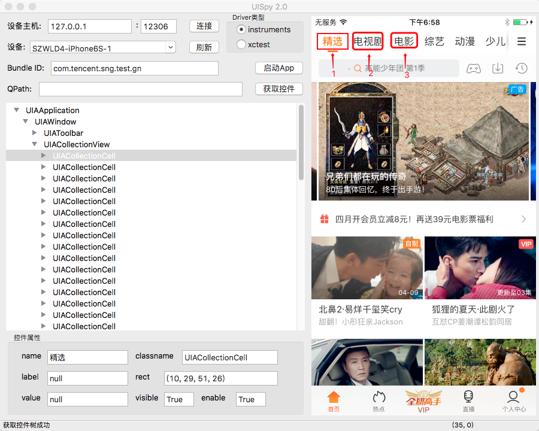
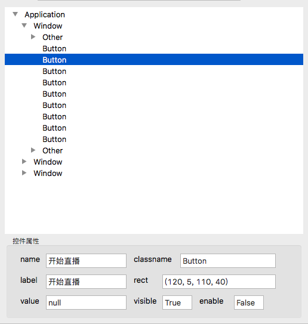

.. include:: ../links/link.ref

.. _encap_qpath:

封装QPath
=======

====
使用场景
====

控件的定位和查找封装在lib包中的xxx_win.py中，建议App一个界面及该界面涉及的操作封装在一个.py文件中，封装的类需要直接继承于标准Window基类。

以封装系统设置App的“通用”控件为例::

    self.updateLocator('通用': {'type': Element， 'root': self，
                           'locator': QPath("/classname = 'Cell' & label = '通用' & maxdepth = 7")})，   
                      
* **type:** 指定控件的类型，和ios中定义的控件类型相对应，如TableView， Slider， ActionSheet等。
* **root:** 指定控件的父节点，指定父节点后，查找控件时，会先找到父节点，然后以父节点为根节点，从根节点开始查找目标控件，这对于你定义的QPath找到多个的情况非常有用，如果指定了父节点，就只会返回父节点下的节点，否则找到多个重复节点就会报错。 如果指定为self，则表示会从整颗控件树根节点开始查找目标控件。
* **locator:** 指定QPath

QPath语法的学习可参考《|qtaf-qpath|_》。qt4i通过QPath定位控件，通过UISpy工具抓取控件树并获取指定控件的QPath。

.. warning:: 查看控件树，需要先部署XCTest Driver运行环境，具体可参考《:ref:`intro_xctestagent`》

使用UISpy即可获取设备当前页面控件树：

.. note:: 若遇到UISpy版本和QT4i版本不匹配的情况（RPC接口找不到），可以执行以下命令清理python环境:

.. code-block:: shell

   $ killall -9 python

在上述第一个用例中提及的InfoWin界面封装::

   from qt4i.icontrols import Window
   from qt4i.icontrols import Element
   from qt4i.qpath import QPath
   
   
   class InfoWin(Window):
    '''DemoApp 输入登录页面
    '''

    def __init__(self， app):
        Window.__init__(self， app)
        self._device = self._app.device

        locators = {
            '通用': {'type': Element， 'root': self，
                      'locator': QPath("/classname = 'Cell' & label = '通用' & maxdepth = 7")}，
            '关于本机': {'type': Element， 'root': self，
                         'locator': QPath("/classname = 'StaticText' & label = '关于本机' & visible = true & maxdepth = 12")}，
            '名称': {'type': Element， 'root': self，
                     'locator': QPath("/classname = 'StaticText' & label = '名称' & visible = true & maxdepth = 11")}，
                              
            # "Table": {"type": Element， "root": self，
            #           "locator": QPath("/classname = 'Table' & visible = true & maxdepth = 10")}，
            # "名称": {"type": Element， "root": "@Table"，
            #           "locator": QPath("/classname='StaticText' & label ='名称' & maxdepth = 1")}，        
             
        }

        self.updateLocator(locators)

    def enter_info(self):
        '''账号密码输入登录函数
        '''
        self.Controls['通用'].click()
        self.Controls['关于本机'].click()
        return self.Controls['名称'].exist()

以用例中的‘名称’为例，UISpy查看和获取控件的QPath:

控件的QPath定位可以基于其绝对路径获取(基于Window查找)，也可以基于相对的路径获取。如果上图‘名称’这个控件基于Table查找，通过相对路径获取的话，QPath也可以写成这样::

   "Table": {"type": Element， "root": self，
             "locator": QPath("/classname = 'Table' & visible = true & maxdepth = 10")}，
   "名称": {"type": Element， "root": "@Table"，
             "locator": QPath("/classname='StaticText' & label ='名称' & maxdepth = 1")}，     

QPath中除了控件路径来限制定位符之外，还可以通过name、label等属性来进一步精确定位，其中label能够进行模糊匹配，使用“label ~= *”。

.. note:: 基于界面的操作和判断都应该封装在lib包的xxxwin.py中，以确保在用例中只调用相关接口然后对返回值进行断言，这样有利于用例的维护和改造。同时封装基本界面时应该考虑通用接口的复用性。

另外，如果控件具有name属性(唯一)，可以直接使用name作为QPath。

.. attention:: 定位符是QPath的必须指定最大查找深度，否则只会在Window下做第一级查找，只用name属性的定位符默认查找深度为20；如果相对路径查找，maxdepth指从父控件开始的查找深度。

在上述第一个用例中提及的NameWin界面封装::

   from qt4i.icontrols import Window
   from qt4i.icontrols import Element
   from qt4i.qpath import QPath
   
   
   class NameWin(Window):
       '''DemoApp 注销登录页面
       '''
   
       def __init__(self， app):
           Window.__init__(self， app)
           self._device = self._app.device
   
           locators = {
                 '更多信息': {'type': Element， 'root': self，
                         'locator': QPath("/classname = 'Button' & label = '更多信息' & visible = true & maxdepth = 11")}，
                 '输入框': {'type': Element， 'root': self，
                        'locator': QPath("/classname = 'TextField' & visible = true & maxdepth = 11")}，
                 '名称值': {'type': Element， 'root': self，
                         'locator': 'qt4i'}，
           }
            
           self.updateLocator(locators)
   
       def modify_name(self， name):
           '''
           '''
           self.Controls['更多信息'].click()
           name_text_field = self.Controls['输入框']
           name_text_field.click()
           name_text_field.value = name
           name_text_field.send_keys('\n')
           return self.Controls['名称值'].exist()
 
以用例中的‘名称值’为例，UISpy查看和获取控件的QPath:

======
理解UI结构
======
   
iOS UI结构最外层是Window，然后是控件逐层嵌套，要访问指定控件，需要给出其唯一路径或者是唯一属性，如果给出QPath能指代多个控件，则会返回第一个实例。可以理解为控件是一个树状结构，从顶部逐级往下查找，给的定位符越明确、唯一越能帮助减少查找时间和查找错误:

定位符::

   QPath("/classname='UIAWindow'/classname='UIACollectionView'/classname='UIACollectionCell' & instance=1")

上述QPath则会返回图中1号CollectionCell控件，如果要返回2号和3号CollectionCell控件，则分别需要用以下QPath::
   
   QPath("/classname='UIAWindow'/classname='UIACollectionView'/classname='UIACollectionCell' & instance=2") #...Q2
   QPath("/classname='UIAWindow'/classname='UIACollectionView'/classname='UIACollectionCell' & instance=3")  #...Q3

.. note:: instance用于限定其左边路径所指对象是第几个是实例，所以上面Q2中会查询到UIACollectionCell层取其第二个实例化对象，Q3依次类推。

=======
控件类型和属性
=======

----
控件类型
----

QT4i提供Element、Alert、Slider、ActionSheet和TableView共五种控件类型:

   * Element为通用控件类型，Button/Element/Image/ToolBar……以及上述未提及的控件类型；
   * Alert用于实例化iOS Alert弹窗控件，具有title和buttons属性，返回标题和所有子按钮；
   * Slider用于实例化iOS SliderBar控件，具有value属性，读取和设置滑动块位置；
   * ActionSheet用于实例化iOS ActionSheet控件，具有buttons属性，返回所有子按钮；
   * TableView用于实例化iOS TableView控件，具有cells属性，返回所有子列表。

----
控件属性
----

通常控件具有label、name、value、visible等属性，可以通过UISpy查看其属性值，Element对象可直接获取上述属性值。如果是可输入型控件入TextView，还可以通过赋值操作来改变其value值。

更多关于控件属性和接口，请参考接口文档。